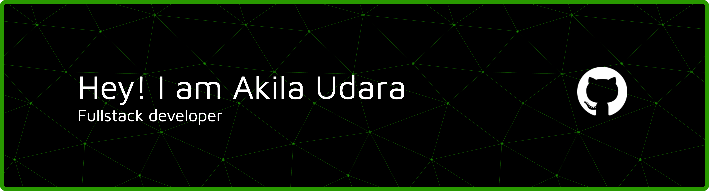
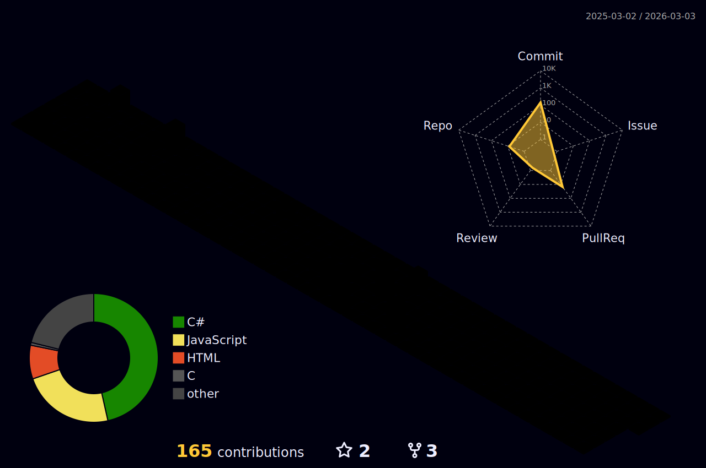

<!-- Profile README for: it23372726/it23372726 -->

<!-- Header banner -->

<h1>Akila Udara</h1>
<h3>CS Undergraduate @ SLIIT · Backend-leaning Full-Stack · DevOps basics</h3>

<!-- CTAs -->

---

## 🧰 Tech Stack

  
  
  
  
  
  
  
  

---

## 📈 GitHub Stats

  
  
  

---

## 🏆 Achievements

  <!-- auto-generated by workflow #1 -->
  

## 🧊 3D Contribution Graph

  <!-- auto-generated by workflow #2 -->
  

