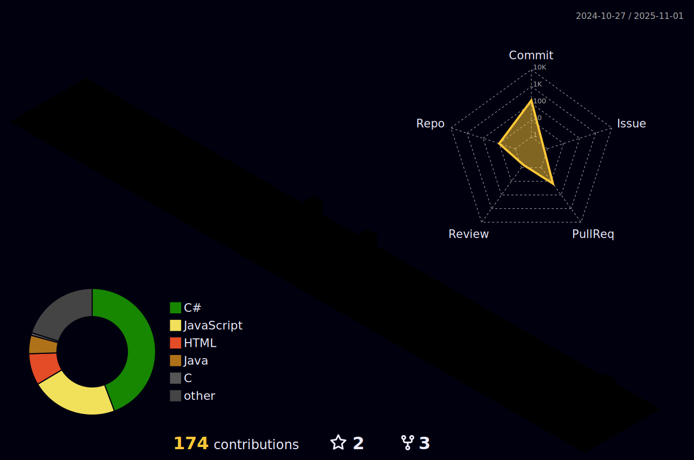

<h1>Akila Udara</h1>
<h3>CS Undergraduate @ SLIIT · Backend-leaning Full-Stack · DevOps Basics</h3>

## Contact
- Email: [akilaudara.p@gmail.com](mailto:akilaudara.p@gmail.com)
- LinkedIn: 
- Portfolio: 

## About me
I like building clean REST APIs, wiring them to simple UIs, and automating the boring parts with CI/CD. I’m most comfortable in .NET and Spring Boot, deploy to Azure when I can, and keep code readable and testable.

## What I do
- REST APIs with JWT/session auth, role-based access, and a clear controller → service → repository split  
- Frontend wiring for React (routing, forms, basic state)  
- DevOps basics: Docker, GitHub Actions, environment secrets, Azure App Service  
- Agile: short sprints, straightforward test plans, and E2E checks when it matters

## Tech stack

  
  
  
  
  
  
  
  
  
  

### Skills at a glance
| Area | Focus | Highlights / Tools |
|---|---|---|
| **Backend APIs** | REST design, DTOs, validation | ASP.NET Web API, Spring MVC, FluentValidation/Jakarta Validation |
| **Auth & Security** | Sessions/JWT, RBAC | ASP.NET Identity (claims), custom filters, Spring Security |
| **Data Layer** | ORM & migrations | EF Core, JPA/Hibernate, Flyway |
| **Frontend** | Wiring & SPA basics | React + Vite, React Router, Tailwind |
| **Testing** | Unit, integration, E2E | xUnit/NUnit, JUnit, Selenium, Postman |
| **DevOps** | CI/CD, containers, envs | Docker, GitHub Actions, Azure App Service |

## Projects
- **SkillLink – Peer-to-Peer Learning**  
  ASP.NET Web API · React · MySQL · JWT · Docker  
  https://github.com/it23372726/SkillLink

- **FitLife Hub – Diet & Workout**  
  Spring Boot · Thymeleaf · MySQL · Sessions  
  https://github.com/it23372726/FitLifeHub

- **ML Mini-Projects**  
  Python · scikit-learn · notebooks  
  https://github.com/it23372726/ml-labs

## Stats

  
  
  

  

